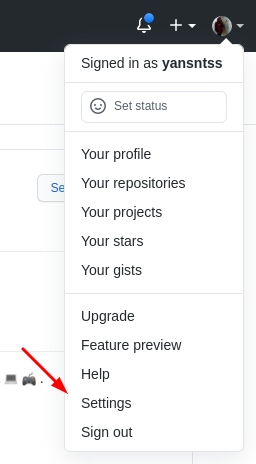
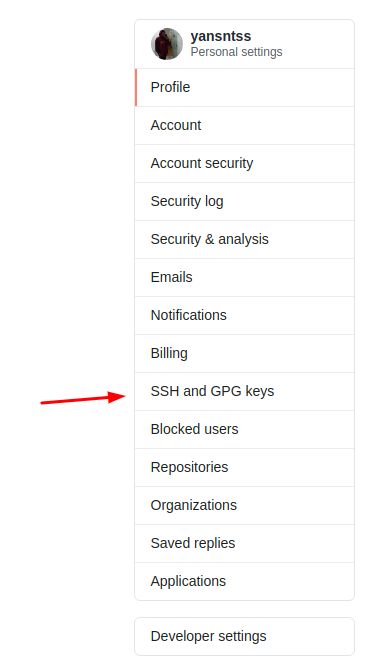
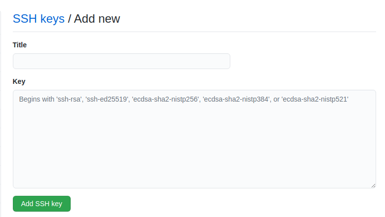

# Configurando SSH no Linux 🐧

Comecei a usar Linux recentemente e to gostando muito, mas me deparei com um desconforto, sempre que eu dava um update em um projeto git, pedia login e senha, isso para mim é muito chato, porém, entendia que era uma questão de segurança mas não me conformei. Pesquisei sobre isso e conheci o SSH ou Key Pair ou chave pública hahaha.

## O que é isso 🤔?

O SSH é um meio de identificação entre seu computador e um servidor SSH usando método de autenticação chave de criptografia pública. Visando pelo lado da segurança, com o SSH você não precisa enviar seu login e senha para a autenticação com servidor remoto, mesmo que uma pessoa mal intencionada intercepte sua transmissão de dados pela rede não poderá ter acesso à suas credencias impossibilitando roubo de seus dados de acesso.


## Agora vamos configurar o ssh com o github

Supondo que você ja tenha uma conta no github e o git instalado na sua maquina, abra o seu terminal e digite:

```bash
ssh-keygen -t rsa -b 4096 -C "seu email do github"
#após isso, aperte enter para as duas perguntas a seguir (ou coloque uma senha se preferir)

```

Isso vai gerar o SSH para fazer a comunicação do seu computador até o github.

Com isso, vai ser gerado um arquivo oculto .ssh no seu home, nesse arquivo vai conter sua chave.

Vamos verificar se o agente ssh está rodando:

```bash
eval "$(ssh-agent -s)"
#vai retornar algo como: agent pid *seu_pid*
```

Agora é bem simples, vamos adicionar e copiar a chave:

```bash
ssh-add ~/.ssh/id_rsa
#vai retornar algo como: Identity added: /home/nome_pc/.ssh/id_rsa (seu email)
```

Vamos instalar o xclip para copiar nossa chave

```bash
#instalar o xclip
sudo apt-get install xclip

#ele vai dar um ctrl+c na sua chave.
xclip -sel clip < ~/.ssh/id_rsa.pub
```

Entre no github e siga esses passos:

Passo 1: Clique em settings



Passo 2: SSH and GPG keys



Passo 3: Clique em new SSHkey


Passo 4: Coloque um titulo de sua preferência e no **key** cole a chave com ctrl +c e aperte em add SSH key.



### Pronto, pode commitar avontade sem se preocupar e sem a necessidade de pôr login senha a cada update! 😜

<br>

## Referência 📖

Aprendi a estilizar o readme com a
Daniele Leao, vai la e deixa um carinho no youtube dela 💜 [Link do video](https://www.youtube.com/watch?v=2alg7MQ6_sI).

Tudo que eu escrevi aqui foi baseado [nesse video](https://www.youtube.com/watch?v=c9QrHKRAtG0&t=179s) do Frávio💜 vai la e insentiva ele a continuar!

Maneirooo né? Quer saber mais sobre o SSH? da um pulo nesse artigo do [ADRIANO ROSA](https://adrianorosa.com/blog/seguranca/ssh-keys.html) 🖖🏾

<br>

## Entre em Contato 💜

[](https://www.linkedin.com/in/yansntss/)
[](https://twitter.com/NpmYan)
[](https://api.whatsapp.com/send?phone=55075988606100&text=Olá!)
